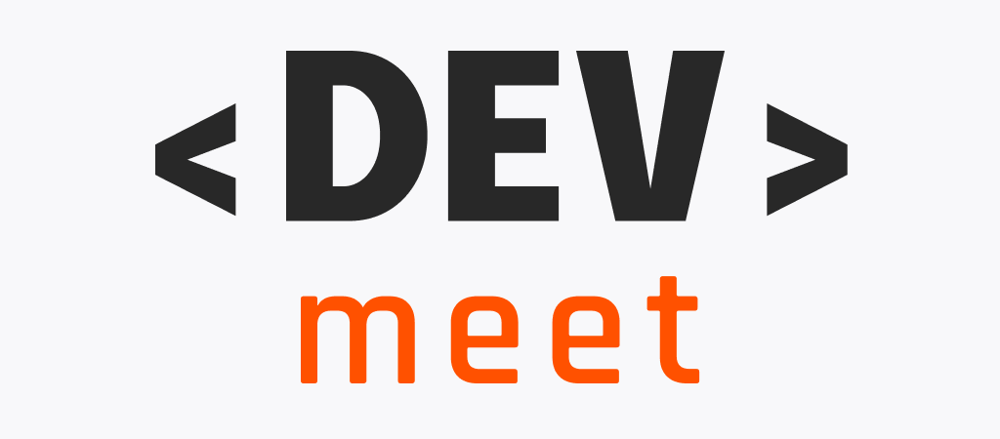

  

# DevMeet

> Keep track of upcoming technology events


## :telescope: Overview

  [🏠 Homepage](https://github.com/lucas-lm/DevMeet)

  > Note: This project was proposed as a challenge by [Rafaella Ballerini](https://github.com/rafaballerini)'s tech [community](https://discord.gg/ballerini). See the prototype on [Figma](https://www.figma.com/file/UgZj1C1DWJlVftvMLz1Aq9/Dev-Meet?node-id=1%3A476).

  DevMeet is an mobile app created with React Native to find the next tech events online.

  There you can see the next events available and check information about them, like the date, the name and description. You can also navigate through the event's screen on app, where you find more information about that, like a timer (countdown) to the event and links to event's webpage itself.

  In Event's screen you can also copy/open the link and subscribe to get a notification when it starts (Vibration + Alert).


## :computer: Techs

- [Typescript](https://www.typescriptlang.org/)
- [React](https://reactjs.org/)
- [React Native](https://reactnative.dev/)
- [Expo](https://expo.dev/)
- [Styled Components](https://styled-components.com/)
- [React Native Navigation](https://reactnavigation.org/)
- [React Native SVG](https://github.com/kristerkari/react-native-svg-transformer)

## :wrench: Requirements

- [Node.js](https://nodejs.org)
- [npm](https://npmjs.com) (Included in the node.js default installation)
- [git](https://git-scm.com/) **OPTIONAL**

You will also need a mobile phone (Android or iOS) or an emulator to run the App.

In case you are using a mobile device, make sure to get __Expo Go__ App installed.
- Android: https://play.google.com/store/apps/details?id=host.exp.exponent&hl=en&gl=US
- iOS: https://apps.apple.com/br/app/expo-go/id982107779

## :zap: Getting started with Development

1. Clone this repo

**Using git**

```bash
git clone https://github.com/lucas-lm/devmeet.git
cd DevMeet
```

**Not using git**

In case you do not have and do not want to install git, you can download the repository (click in code -> Download ZIP) and extract the project folder using any zip program (Right click on downloaded zip file, unzip to...)

After that you can open a new terminal on the project's folder (`you/path/to/devmeet`) and follow along with the next instructions.

2. Install the dependencies

```bash
npm install
```

3. Start the development server

```bash
npm start
```

4. Open the app and start coding 🎉

You are ready to go now! Just open the app in your mobile device or emulator and start editing the code.

To open in device: Scan the QR Code shown in the terminal with Expo Go App

To open in emulator or web: With the terminal focused, press **a** to Android, **i** to iOS

Any saved change on the code will automatically refresh the app.

## :sparkles: App Features

- Agenda of next tech events
- Information about events
- Notifications on event start (in-app only, no push notification)

## :bomb: Next steps

- [ ] Set up Push Notifications
- [ ] Create a real backend
- [ ] Handle error cases like no network connection
- [ ] Add some animations

## :star2: Contributing

Contributions, issues and feature requests are welcome!

- ⭐️ Star the project
- 🐛 Find and report issues
- 📥 Submit PRs to help solve issues or add features

Feel free to check [issues page](https://github.com/lucas-lm/DevMeet/issues). You can also take a look at the contributing guide.

## :bow: Author

**Lucas Miranda**
* Email: lucas-lm@outlook.com
* GitHub: [@lucas-lm](https://github.com/lucas-lm)
* LinkedIn: [@lucas-lm](https://linkedin.com/in/lucas-lm)

## :books: License

Copyright © 2020 Lucas Miranda
This project is [MIT](license) licensed.
